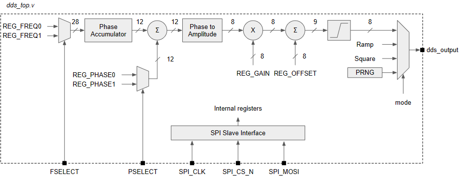

# basic_dds

Work in progress : basic Direct digital synthesis module in Verilog

The idea is to send this module to TinyTapeout..

## Hierarchy

- tt_um_basic_dds.v
  - spi_slave_interface.v
  - dds_top.v
    - dds.v
      - prng.v

## Ressource usage

TODO : show LUT + FF usage

## DDS

TODO : explain how this DDS works

## SPI Slave Interface

TODO : explain here how to configure the component and describe the registers

| Address           | Register Name | Register content                                          |
| :---------------: |:-------------:| :---------------------------------------------------------|
| 4'h0              | CONTROL       | [1:0] Output mode (00=sinus; 01=ramp; 10=square; 11=prng) |
| 4'h1              | REG_FREQ0     | [27:0] Frequency word 0                                   |
| 4'h2              | REG_FREQ1     | [27:0] Frequency word 1                                   |
| 4'h3              | REG_PHASE0    | [11:0] Phase Offset word 0                                |
| 4'h4              | REG_PHASE1    | [11:0] Phase Offset word 1                                |
| 4'h5              | REG_GAIN      | [11:0] Gain of the sinus output                           |
| 4'h6              | REG_OFFSET    | [11:0] Offset of the sinus output                         |
| Others            | No registers  | Not used                                                  |
