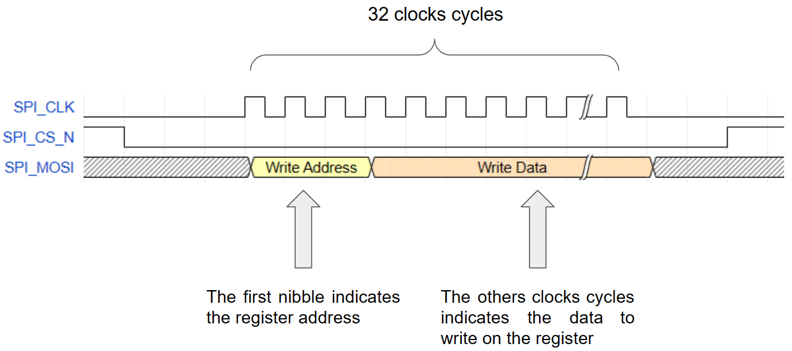

# basic_dds

This repository contains a Direct Digital Synthesis module in Verilog. It can generate sinus, ramp, square and prng data. I want to use this design on Tiny Tapeout TT05. This README contains some explanation about the design and how to use it. The code is quite simple.

As usual, we first generate a phase ramp. The slope of this ramp defines the frequency of the output. After this ramp, we translate this phase to a sinus value. In this design, I use a small read-only memory. I added a gain, offset and saturation. After that, the output of the design is muxed between multiple data.

## Hierarchy

- tt_um_basic_dds.v
  - inputs_resync.v
  - dds_top.v
    - spi_slave_interface.v
    - dds.v
      - prng.v

## Ressource usage

| LUT       | FF            | Block Memory bits | DSP Block            |
| :-------: |:-------------:|:-----------------:|:--------------------:|
| ~110      | ~200          | 1                 | 1                    |

**Target** :  Cyclone V 
**Fmax**   : 140 MHz

## SPI Slave Interface

This design also contains a SPI Slave Interface. This interface is used to configure the various registers of the design. It is a write-only interface since it doesn't have a MISO signal. It supports only 32b access. The most significant bit is transmitted first on the MOSI signal. The address of the register is on the bits [31:28]. This design samples the SPI_MOSI signal on the rising edge of the SPI_CLK signal.

| Address           | Register Name | Register content                                          |
| :---------------: |:-------------:| :---------------------------------------------------------|
| 4'h0              | CONTROL       | [1:0] Output mode (00=sinus; 01=ramp; 10=square; 11=prng) |
| 4'h1              | REG_FREQ0     | [27:0] Frequency word 0                                   |
| 4'h2              | REG_FREQ1     | [27:0] Frequency word 1                                   |
| 4'h3              | REG_PHASE0    | [11:0] Phase Offset word 0                                |
| 4'h4              | REG_PHASE1    | [11:0] Phase Offset word 1                                |
| 4'h5              | REG_GAIN      | [7:0] Gain of the sinus output                            |
| 4'h6              | REG_OFFSET    | [7:0] Offset of the sinus output                          |
| Others            | No registers  | Not used                                                  |

## Interesting links

- [Analog Devices - Ask The Application Engineer—33: All About Direct Digital Synthesis](https://www.analog.com/en/analog-dialogue/articles/all-about-direct-digital-synthesis.html)
- [Analog Devices - A Technical Tutorial on Digital Signal Synthesis, 1999](https://www.analog.com/en/education/education-library/technical-tutorial-dds.html)
- [Analog Devices - MT-085 Fundamentals of Direct Digital Synthesis (DDS)](https://www.analog.com/media/en/training-seminars/tutorials/MT-085.pdf)
- [Analog Devices - AD9833, 12.65 mW, 2.3 V to 5.5 V, Low Power Programmable Waveform Generator](https://www.analog.com/media/en/technical-documentation/data-sheets/ad9833.pdf)
